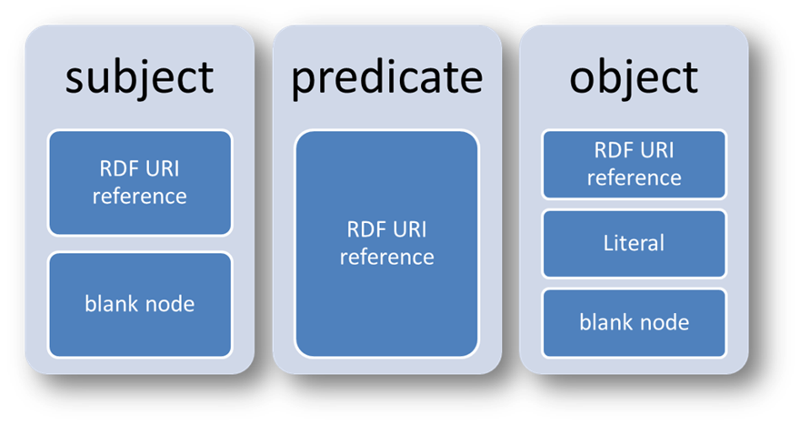

#HSLIDE

# Semantic Web
## Block II

Hochschule H,
[@im_hsh](https://twitter.com/im_hsh)

#HSLIDE

 # **Themenblock II**
 

   Serialisierung von RDF ( Turtle, N-Triples) 

   -------------------------------------------- 
   RDF/XML

   -------------------------------------------- 
   Wissensorganisation mit Vokabularen

   -------------------------------------------- 

#HSLIDE
   
   
## Serialisierung von RDF 
##      (Turtle, N-Triples) 

#VSLIDE
## RDF Wiederholung ##
--------------------------------------------

  * Tripelstruktur (= RDF-Triple) -&gt;  
  *   **&lt;Subjekt&gt;&lt;Prädikat&gt;&lt;Objekt&gt;**
   
  * Jedes Triple – eine Aussage (RDF-Statement)
   
  * Subjekt und Prädikat werden durch URI bezeichnet, Objekt – durch einen URI oder ein RDF-Literal
   
  * Ausnahme: Blank Nodes – Leere Knoten zur Beschreibung von unbenannten Ressourcen  
  ###### Vgl. Hitzler u. a.(2008), S.40 ######

``&size=auto 25%``
---?image=pics/bild1.png&size=auto 25%&position = right&position = bottom
#VSLIDE 
   
   

